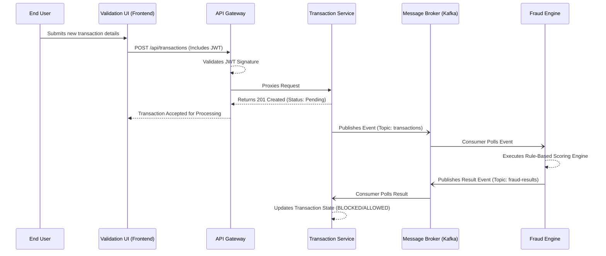

# CS 331 (Software Engineering Lab) - Assignment 5 Solution

**Project Title:** Automated Fraud Detection and Alerting System

---

## I. Hosting Application Components [Marks = 5]

### 1. Host Site
The application consists of a decoupled frontend, backend microservices, and managed data stores. The target hosting environments are distributed as follows:

*   **Frontend (FraudGuard Console):** Hosted on **Vercel**. Vercel acts as a global Content Delivery Network (CDN) optimized for React/Vite Single Page Applications (SPAs).
*   **Backend Microservices (Java Spring Boot):** Hosted on **Oracle Cloud Infrastructure (OCI)** Compute Instances (specifically Ampere A1 ARM VMs) utilizing a containerized `docker-compose` environment to run the API Gateway, Auth Service, Transaction Service, Fraud Engine, and Alert Service.
*   **Message Broker (Apache Kafka):** Hosted via **Upstash**, providing a serverless Kafka cluster for decoupled event streaming.
*   **Databases (MySQL Engine & Redis Cache):** Hosted via **Aiven** and **Upstash Redis** respectively for managed, high-availability data persistence.

### 2. Deployment Strategy
The deployment process follows a systematic, containerized CI/CD pipeline:

*   **Containerization:** Every backend microservice is encapsulated within its own Docker container, defined by a specific `Dockerfile`. 
*   **Orchestration:** A root `docker-compose.yml` file is used to orchestrate the entire backend suite (all 5 microservices), defining the internal bridge networks and service dependencies.
*   **Continuous Integration (CI):** GitHub Actions is configured to trigger on pushes to the `main` branch. This pipeline builds the standard `.jar` artifacts using Maven (`mvn clean package`) and produces the resulting Docker images.
*   **Continuous Deployment (CD):** Upon successful build, the images are deployed to the Oracle Cloud VM. Environment variables (such as Database URIs, Kafka Bootstrap Servers, and JWT secrets) are injected securely via the VM's environment configuration.
*   **API Routing:** The deployed **API Gateway** acts as the single entry point. The frontend application is configured via `VITE_API_URL` to route all external traffic to the Gateway, which in turn reverse-proxies requests to the internal domain name of the appropriate microservice.

### 3. Security
*   **Identity & Access Management:** Implement **JSON Web Tokens (JWT)** for stateless authentication. The Auth Service issues tokens upon login; subsequent backend requests enforce Role-Based Access Control (RBAC) to ensure only authorized personnel can configure fraud rules or view alerts.
*   **Network Firewalls:** The API Gateway is the only backend component exposed to the public internet. It implements strict **Cross-Origin Resource Sharing (CORS)** policies to accept traffic exclusively from the Vercel frontend domain.
*   **Data Protection:** Transport Layer Security (TLS/HTTPS) is enforced universally for data-in-transit. At-rest sensitive data, such as user passwords in the MySQL database, are hashed with salt using the **BCrypt** algorithm.

---

## II. End User Access and Interaction Diagrams [Marks = 5+5=10]

### Access Method
End users—typically members of the Operations or Fraud Analysis teams—access the system via standard web browsers. They navigate to the public URL provided by Vercel (e.g., `https://fraudguard-console.vercel.app`). The Vercel CDN serves the React frontend, and all dynamic user interactions generate asynchronous REST API calls directed toward the centralized API Gateway.

### Pictorial Representation (Sequence Diagram)
The diagram below illustrates the flow of interaction when an end-user submits a transaction into the system, detailing the journey from the frontend through the backend microservices.

---

## III. Implementation of Application Components & Interactions

We deploy a highly decoupled microservices architecture where services primarily interact asynchronously via an Apache Kafka event bus. This prevents bottlenecks and ensures the system remains responsive under heavy load. Below is the implementation trace demonstrating the interaction between two core components: the **Transaction Service** and the **Fraud Engine**.

### 1. The Transaction Service Component
This component exposes REST APIs to ingest telemetry. Rather than performing blocking validations, it writes the transaction to the database in a "Pending" state and acts as a **Producer**. It serializes the transaction object into JSON and publishes it to the `transactions` Kafka topic.

### 2. The Fraud Engine Component
This is a background processing daemon with no public endpoints. It acts as a **Consumer**. It continuously polls the `transactions` Kafka topic. Upon receiving data, it runs the transaction payload against a configured rule engine (e.g., velocity checks, high-amount thresholds). It then assumes the role of a Producer, publishing its final verdict (Allow, Block, Flag) to the `fraud-results` topic.

### Interaction Trace (Component Log Output)
The following pseudo-logs demonstrate the precise point of interaction between the two components after a user submits a $5000 transaction.

1.  **[Transaction Service]** `[INFO] Received POST /api/transactions for User ID: U123`
2.  **[Transaction Service]** `[INFO] Persisted TXN-89412 to MySQL. Status: PENDING.`
3.  **[Transaction Service]** `[DEBUG] Producer: Published TXN-89412 to Kafka topic [transactions]`
4.  *(Component Interaction Occurs over Event Bus)*
5.  **[Fraud Engine]** `[DEBUG] Consumer: Polled 1 record from topic [transactions]`
6.  **[Fraud Engine]** `[INFO] Executing Rule Suite on TXN-89412...`
7.  **[Fraud Engine]** `[WARN] Rule Violation: Transaction Amount ($5000) exceeds configured threshold.`
8.  **[Fraud Engine]** `[DEBUG] Producer: Published BLOCKED verdict for TXN-89412 to topic [fraud-results]`
9.  *(Component Interaction Resolves)*
10. **[Transaction Service]** `[DEBUG] Consumer: Polled 1 record from topic [fraud-results]`
11. **[Transaction Service]** `[INFO] Updated state of TXN-89412 to BLOCKED in database.`
