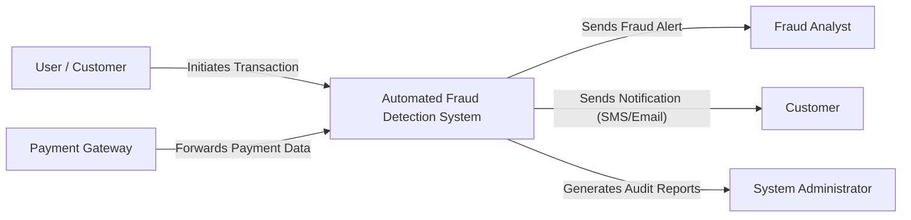

This diagram shows the **Automated Fraud Detection and Alerting System** as a unified Microservices-based system and its interaction with external entities. Transaction data flows into the system from the **User** via the **Payment Gateway**, while fraud alerts, notifications, and summarized reports flow outward to different users and supporting services.

The **Fraud Analyst** receives detailed fraud alerts for investigation, the **Notification Service** (internal/external) delivers alert messages to concerned parties, and the **System Administrator** obtains system reports and audit-related information for monitoring and control.

By presenting only the external data exchanges and hiding internal microservice processing details, the context diagram clearly defines the system boundary and provides an overall understanding of how the system communicates with its surrounding environment.

The system functions as a centralized platform that monitors incoming transactions and coordinates fraud detection activities. It ensures secure and well-defined data exchanges with external entities, maintaining clear system boundaries. Real-time alert generation helps in minimizing financial risks by enabling rapid response to suspicious activities.

