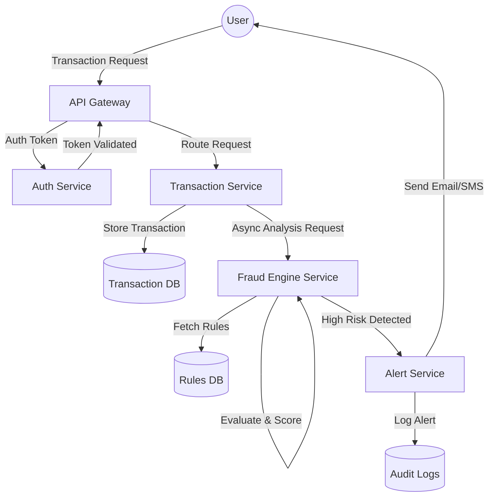

This Level 1 DFD illustrates the internal flow of data between the specific microservices of the system.

1.  **API Gateway**: Receives the initial transaction request and routes it.
2.  **Auth Service**: Validates the user's identity and token before processing.
3.  **Transaction Service**: Persists the transaction and initiates the fraud check.
4.  **Fraud Engine Service**: Analyzes the transaction against defined rules and patterns to compute a risk score.
5.  **Alert Service**: If the risk score is high, this service generates an alert and notifies stakeholders.

The separation of concerns ensures that each microservice handles a specific part of the data flow, improving scalability and maintainability.

