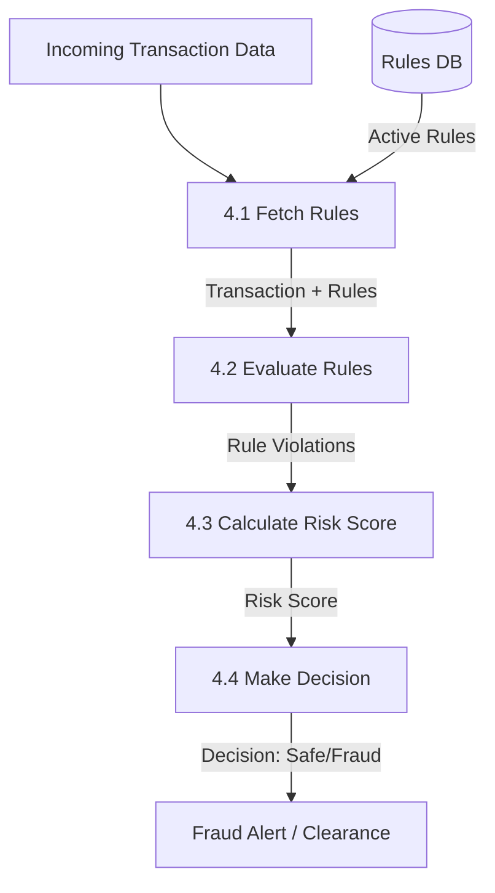

# Level 2 DFD - Fraud Engine Service

This diagram expands on **Process 4: Fraud Engine Service** from the Level 1 DFD. It details the internal logic of how a transaction is processed to determine if it is fraudulent.

## Sub-processes:

4.1 **Fetch Rules**: Retrieve active fraud detection rules from the Rules Database based on transaction attributes (amount, location, user history).
4.2 **Evaluate Rules**: Apply the fetched rules against the transaction data (e.g., "Amount > $10,000" or "Location mismatch").
4.3 **Calculate Risk Score**: Assign a weighted score based on rule violations.
4.4 **Generate Decision**: Compare the total risk score against a threshold to determine if the transaction is "Safe", "Suspicious", or "Fraudulent".

