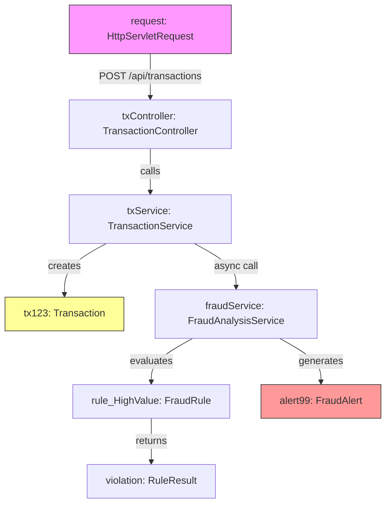

# UML Object Diagram (Runtime View)

The object diagram represents runtime instances of the system's classes during the processing of a specific **Suspicious Transaction**.

**Scenario**: A user submits a high-value transaction ($15,000) which triggers a definition of fraud.

## Runtime Objects

*   **req1**: An instance of the incoming HTTP request.
*   **txService**: The active instance of the Transaction Service logic.
*   **tx123**: The specific Transaction entity created in memory.
*   **fraudEngine**: The service instance performing analysis.
*   **rule_HighValue**: A specific rule policy object loaded for evaluation.

