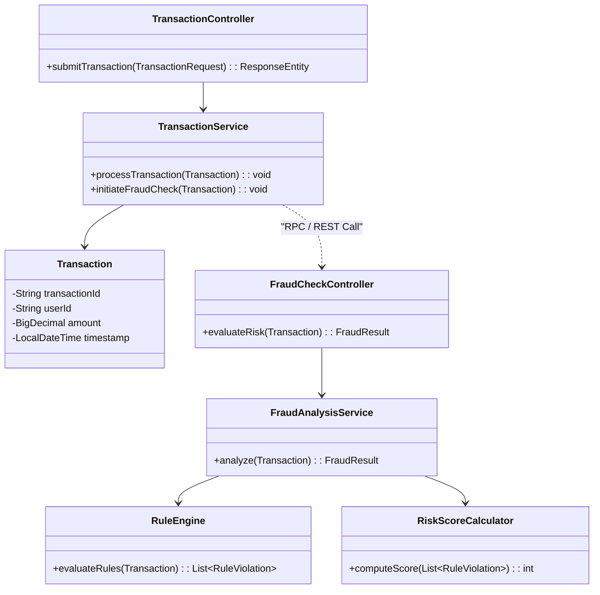

# Class Diagram - Microservices Components

This Class Diagram illustrates the key software components (classes/interfaces) within the primary microservices of the **Automated Fraud Detection System**. It highlights the separation of concerns between standard transaction processing and the specialized fraud detection logic.

## Key Classes by Service

### 1. Transaction Service
*   **TransactionController**: REST API endpoint for receiving transactions.
*   **TransactionService**: Business logic for validation and persistence.
*   **TransactionRepository**: Interface for database operations.
*   **Transaction**: Entity representing the financial data.

### 2. Fraud Engine Service
*   **FraudCheckController**: Internal API for receiving analysis requests.
*   **FraudAnalysisService**: Core logic that orchestrates rule evaluation.
*   **RuleEngine**: Component that processes individual rules.
*   **RiskScoreCalculator**: Computes the final risk score.

### 3. Shared/Common
*   **FraudAlert**: DTO containing alert details.

## Explanation
The diagram shows how the `TransactionService` handles the initial request and creates a `Transaction` entity. It then communicates (via RPC/REST) with the `FraudCheckController` in the Fraud Engine. The `FraudAnalysisService` coordinates the `RuleEngine` to find violations and uses the `RiskScoreCalculator` to determine the final outcome.

