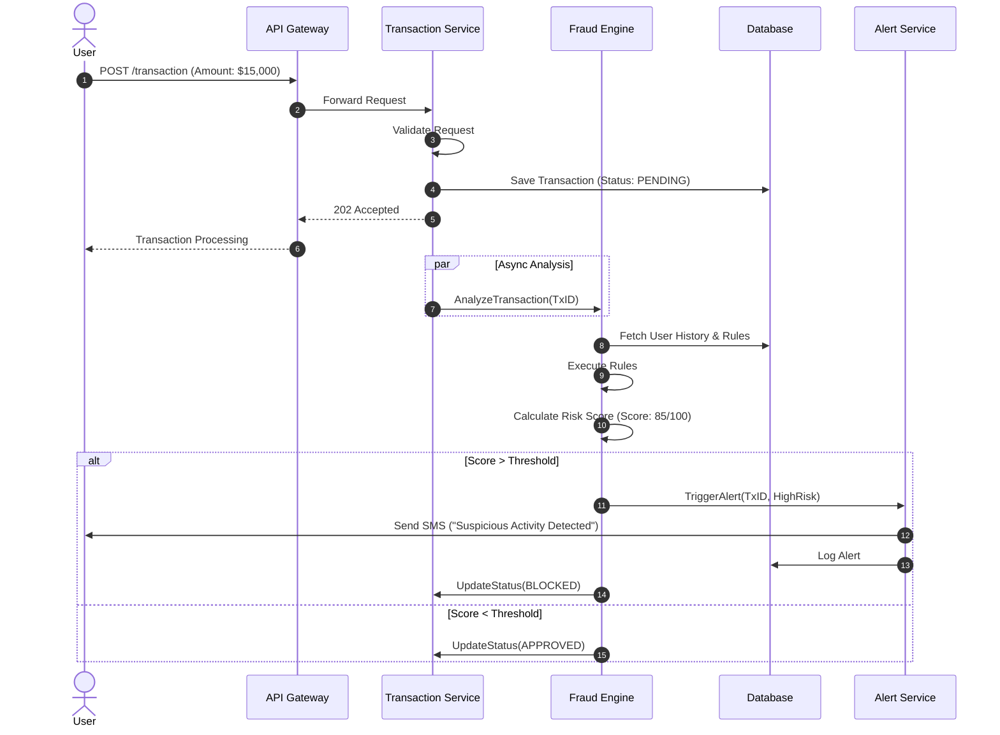

# Sequence Diagram - Suspicious Transaction Flow

This sequence diagram depicts the flow of operations when a user initiates a transaction that is eventually flagged as fraudulent.

## Participants
- **User**: The initiator.
- **API Gateway**: Entry point.
- **Transaction Service**: Manages transaction lifecycle.
- **Fraud Engine**: Analyzes risk.
- **Alert Service**: Notifies stakeholders.
- **Database**: Persistence layer.

